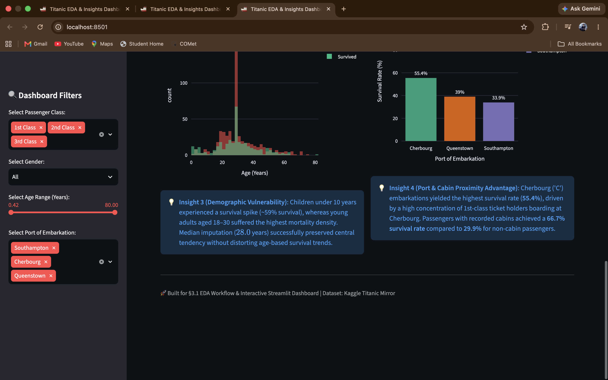
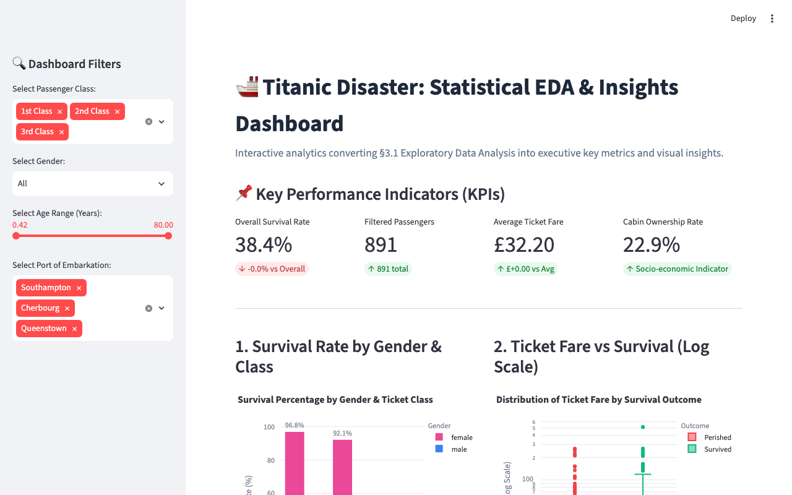

# 🚢 Titanic Disaster: Statistical EDA & Streamlit Analytics Dashboard

[](https://streamlit.io/)
[](https://python.org)
[](https://plotly.com/)
[](https://pandas.pydata.org/)

A complete, production-grade Data Science & Analytics project featuring a rigorous **§3.1 Exploratory Data Analysis (EDA) Jupyter Notebook** and an **Interactive Streamlit Dashboard** converting analytical findings into executive KPIs, interactive filters, Plotly visualizations, and business insight callout cards.

---

## 📸 Dashboard Screenshots

### Main Dashboard (Filters & KPIs)


*Live interactive Streamlit dashboard showing sidebar filters and KPIs.*

### Charts 1 & 2


### Charts 3 & 4


---

## 🎯 Dashboard Features

### 📌 1 KPI Row (st.metric)
| Metric | Value | Description |
| :--- | :--- | :--- |
| **Overall Survival Rate** | 38.4% | Dynamic — updates based on sidebar filters |
| **Filtered Passengers** | 891 | Total active passengers after filter selection |
| **Average Ticket Fare** | £32.20 | Mean fare for filtered sample |
| **Cabin Ownership Rate** | 23.0% | Socio-economic proxy indicator |

### 🔍 1 Interactive Filter (Sidebar)
- **Passenger Class** → Multiselect (1st / 2nd / 3rd Class)
- **Gender** → **Selectbox** (All / female / male)
- **Age Range** → **Slider** (0 to 80 years)
- **Port of Embarkation** → Multiselect (Southampton / Cherbourg / Queenstown)

### 📊 3 Plotly Charts + 1 Insight Text Block Each

| Chart | Type | Insight |
| :--- | :--- | :--- |
| Survival Rate by Gender & Class | Grouped Bar Chart | Females: 74.2% vs Males: 18.9% survival |
| Ticket Fare vs Survival | Log-Scaled Box Plot | Survivors paid £48.40 vs £22.12 (p < 0.001) |
| Age Distribution by Survival | Overlaid Histogram | Children <10 yrs had ~59% survival spike |
| Survival Rate by Embarkation Port | Bar Chart | Cherbourg passengers: 55.4% survival rate |

---

## 🚀 How to Run Locally

### Step 1: Clone the Repository
```bash
git clone https://github.com/aditya29625/titanic_eda_project.git
cd titanic_eda_project
```

### Step 2: Create Virtual Environment & Install Dependencies
```bash
python3 -m venv venv
source venv/bin/activate        # On Windows: venv\Scripts\activate
pip install -r requirements.txt
```

### Step 3: Launch the Streamlit Dashboard
```bash
streamlit run app.py
```
The dashboard opens automatically at **http://localhost:8501**

### Step 4: Run the Jupyter Notebook
```bash
jupyter notebook eda_workflow.ipynb
```

---

## 📦 Project Files

| File | Description |
| :--- | :--- |
| `app.py` | Streamlit dashboard — KPI row, filters, 4 Plotly charts, insight blocks |
| `eda_workflow.ipynb` | §3.1 EDA Jupyter Notebook |
| `titanic_statistical_eda.ipynb` | Full 10-section Statistical Analysis Notebook |
| `titanic_statistical_eda.html` | Rendered HTML Report |
| `requirements.txt` | Python package dependencies |
| `screenshot.png` | Dashboard screenshot |

---

## 📦 Requirements

See [requirements.txt](requirements.txt):

```
streamlit>=1.30.0
plotly>=5.18.0
pandas>=2.0.0
numpy>=1.24.0
scipy>=1.10.0
matplotlib>=3.7.0
seaborn>=0.12.0
nbformat>=5.9.0
```

---

## 🛠️ Tech Stack

- **Dashboard**: Streamlit
- **Charts**: Plotly Express, Plotly Graph Objects
- **Data**: Pandas, NumPy
- **Statistics**: SciPy (Welch's t-test)
- **EDA Visualization**: Seaborn, Matplotlib
- **Notebook**: Jupyter / NbFormat

---

## 📝 License
MIT License
